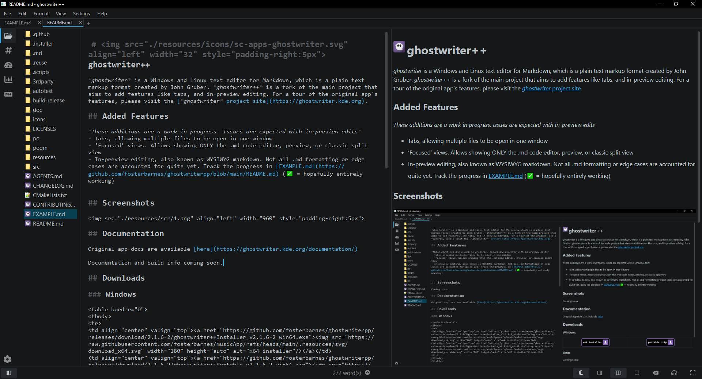
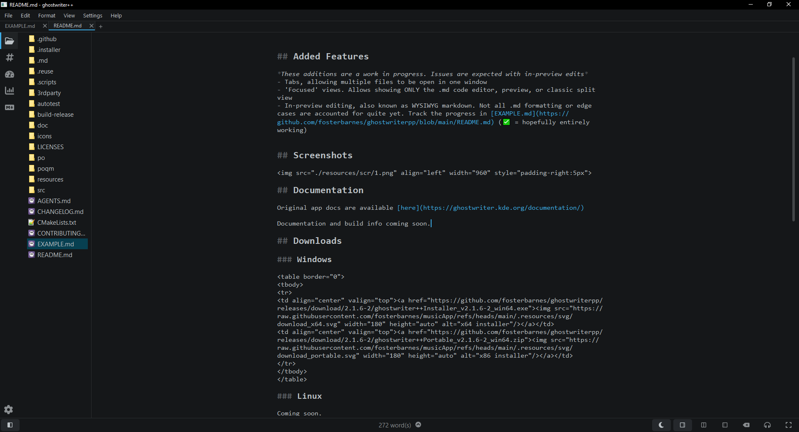
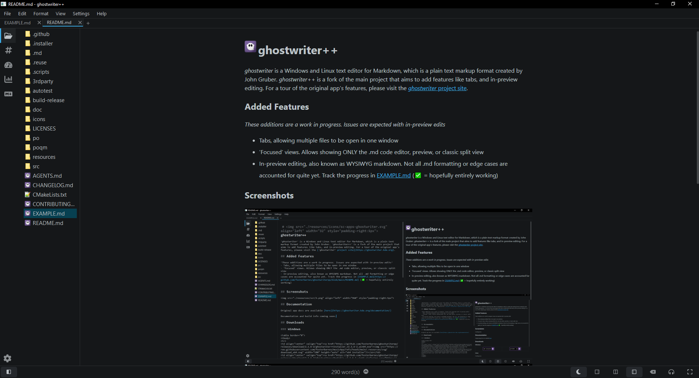

 #  ghostwriter++

*ghostwriter* is a Windows and Linux text editor for Markdown, which is a plain text markup format created by John Gruber. *ghostwriter++* is a fork of the main project that aims to add features like tabs, and in-preview editing. For a tour of the original app's features, please visit the [*ghostwriter* project site](https://ghostwriter.kde.org).

## Added Features

*These additions are a work in progress. Issues are expected with in-preview edits*
- Tabs, allowing multiple files to be open in one window
- 'Focused' views. Allows showing ONLY the .md code editor, preview, or classic split view
- In-preview editing, also known as WYSIWYG markdown. Not all .md formatting or edge cases are accounted for quite yet. Track the progress in [EXAMPLE.md](https://github.com/fosterbarnes/ghostwriterpp/blob/main/README.md) (✅ = hopefully entirely working)

 
## Screenshots

### Split View

### Editor View

### Full Preview

## Documentation

Original app docs are available [here](https://ghostwriter.kde.org/documentation/)

Documentation and build info coming soon.

## Downloads

### Windows

<table border="0">
<tbody>
<tr>
<td align="center" valign="top"></td>
<td align="center" valign="top"></td>
</tr>
</tbody>
</table>

### Linux

Coming soon.

### MacOS

Coming soon.

## Licensing

The source code for *ghostwriter* is licensed under the [GNU General Public License Version 3](http://www.gnu.org/licenses/gpl.html).  However, various icons and third-party FOSS code (i.e., cmark-gfm, MathJax, etc.) have different licenses compatible with GPLv3.  Please read the COPYING or LICENSE files in the respective folders for the different licenses.

